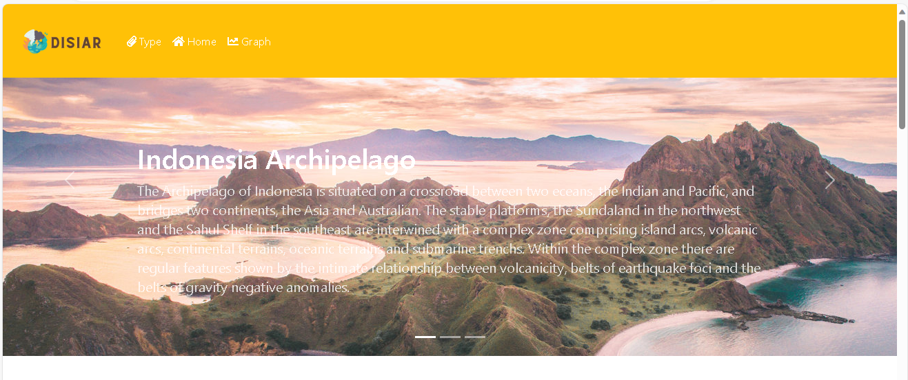
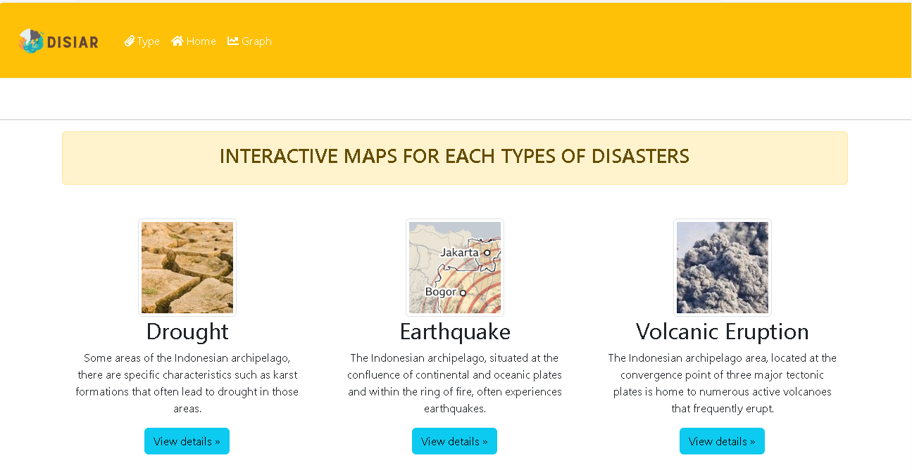
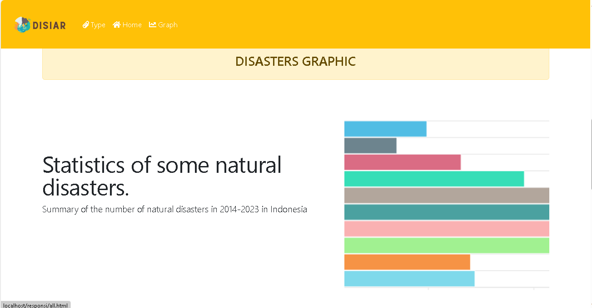
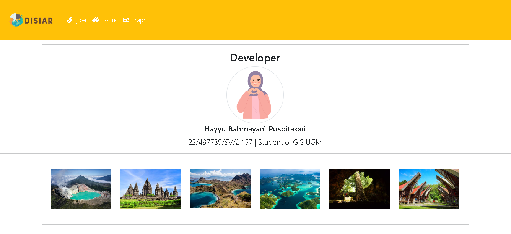
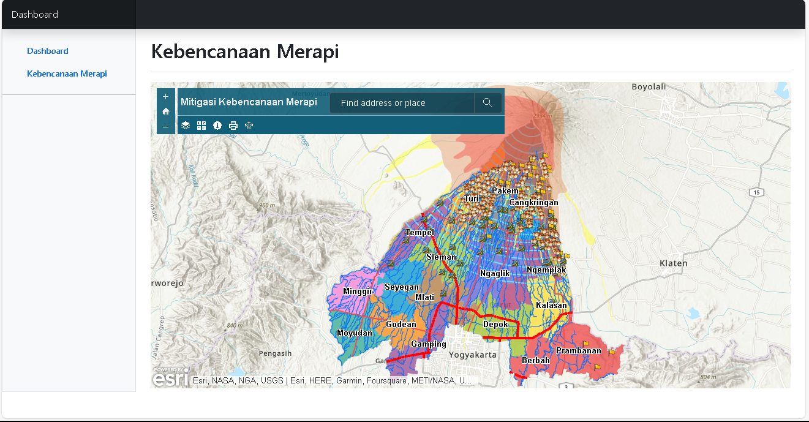
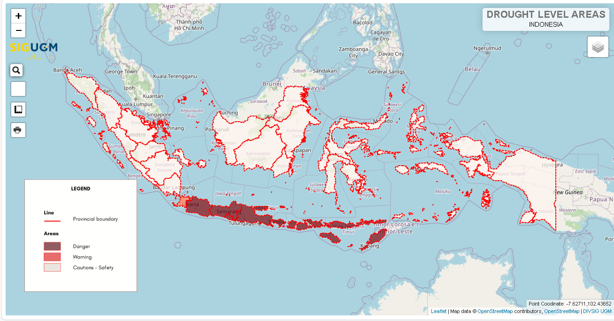
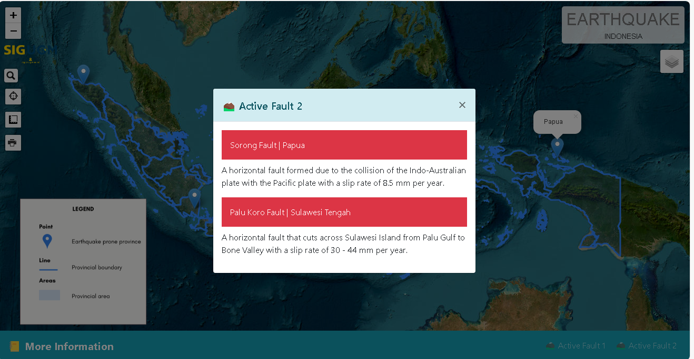
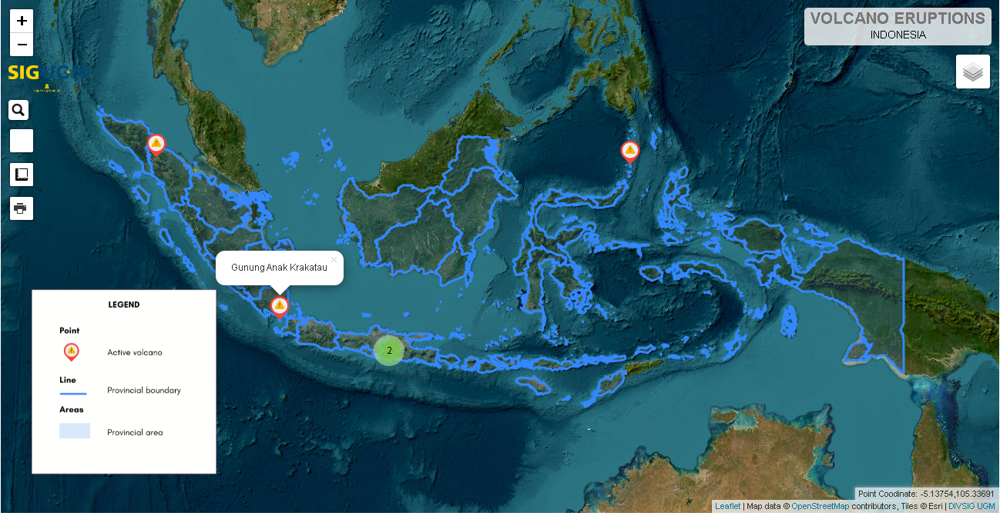
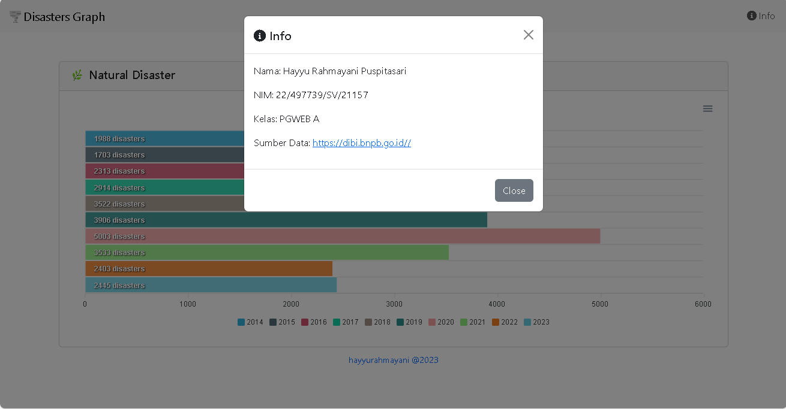
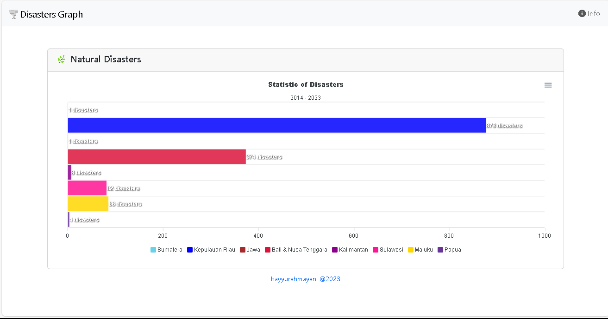

# Responsi PGWEB
Produk Responsi

>**DISIAR**

>Disaster in Indonesian Archipelago (Disiar) adalah sebuah sistem informasi geografis sederhana berbasis website yang menyediakan informasi terkait beberapa bencana alam dalam bentuk peta interaktif dan juga grafik menarik. Bencana yang ditampilkan ialah bencana alam seperti kekeringan, erupsi, dan juga gempa bumi.

>**Komponen Pembangun**

>Komponen pembangun yang digunakan ialah GeoServer, Database, Library JavaScript & CSS dari Bootstrap dan Apexchart, serta LeafletJS (Peta dan Plugin)

>**Sumber Data**

>Gambar:
1.[Padar Island](https://helloflores.com/explore/padar-island)
2.[Merapi Eruption](https://www.chockysihombing.com/mount-merapis-eruptions-2010/)
3.[Tsunami Aceh](https://weather.com/news/news/indonesia-tsunami-photos)

>Data
1.[Grafik](https://dibi.bnpb.go.id/)
2.[Gempa](https://indonesiabaik.id/infografis/wilayah-rawan-gempa-di-indonesia#:~:text=Direktorat%20Vulkanologi%20dan%20Mitigasi%20Bencana,Nusa%20Tenggara%20Barat%2C%20Nusa%20Tenggara)
3.[Kekeringan](https://www.kominfo.go.id/content/detail/19722/bmkg-sejumlah-wilayah-indonesia-berpotensi-kekeringan/0/berita)
4.[Erupsi](https://magma.vsi.esdm.go.id/)

>**Link Tampilan Website**

>Link: https://youtu.be/2ri2oD4-OVU?si=n7XacGKmTmpBMtjr 

>**Tangkapan Layar Komponen**
>
>
>
>
>.png)
>.png)
>
>
>
>
>
>

>**Motivasi diri:** *Nothing is out of reach*
